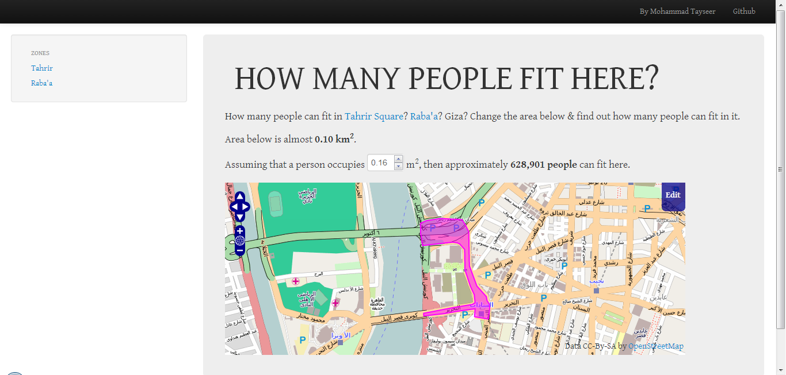

Measure how many people fit in a certain area, e.g. how many people can fit in Tahrir Square in Cairo, Egypt.

By default, I consider that each person will occupy a square of 40cm x 40cm, or 0.16m2, but you can change this.

The site is live at http://HowManyPeopleFitHere.rawa7.com/

The code is in the public domain.
